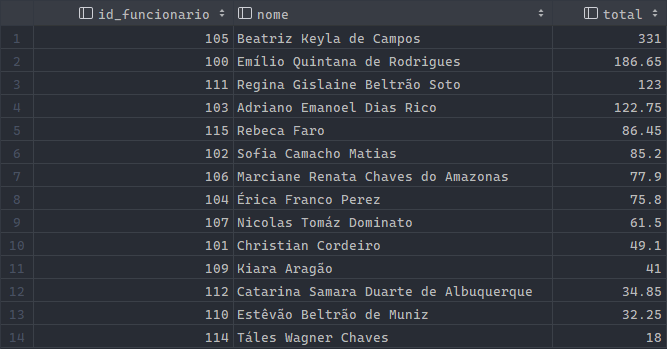

# Vale-Transporte  
  
Relatório do desenvolvimento da aplicação de gerenciamento de vale-transporte .
  
Alunos: Eduardo Zanetta (20203087), Pedro Matiucci (20204505)
Professor: Vinícius Ramos
Disciplina: Banco de Dados I (INE5613)
Instituição: Universidade Federal de Santa Catarina - UFSC  


*Última atualização: 19/06/2023*
## Sumário  
  
- [Seção 1: Objetivo geral](#objetivo-geral)  
- [Seção 2: Descrição Detalhada](#descricao-detalhada)  
- [Seção 3: Modelagem Conceitual](#modelagem-conceitual)  
- [Seção 4: Modelagem Logica](#modelagem-logica)  
- [Seção 5: Script DDL](#script-ddl)  
- [Seção 6: Script DML](#script-dml)  
- [Seção 7: Consultas](#consultas)  
  
## <a name="objetivo-geral"></a>Objetivo Geral  
  
O objetivo principal do sistema de recarga e uso de cartão em ônibus é tornar o pagamento no transporte público mais fácil e conveniente,  
substituindo o dinheiro em papel por um cartão eletrônico que pode ser recarregado.  
O sistema foi desenvolvido para simplificar o processo de embarque,  
oferecendo aos usuários uma maneira segura e prática de pagar.  
Além disso, ele permite que a empresa de transporte colete informações precisas sobre a demanda e como os cartões são utilizados,  
o que ajuda no planejamento e na melhoria da experiência dos usuários.  
  
## <a name="descricao-detalhada"></a>Descrição Detalhada  
O sistema permite que os usuários recarreguem seus cartões por meio da assistência de um funcionário, registrando as transações como `Pedido_Recarga`. Os cartões recarregados podem ser utilizados nas catracas dos ônibus, gerando *logs* armazenados em `Uso_Do_Cartao`.  
  
### Entidades e Relacionamentos:  
O sistema é composto por diversas entidades principais: `Usuario`, `Cartao`, `Funcionario`, `Pedido_Recarga`, `Catraca`, `Uso_Do_Cartao` e `Linha`. A seguir, serão apresentados os relacionamentos entre essas entidades:  
  
#### Relacionamento entre Usuario e Cartao:  
- Cada usuário está vinculado a apenas um cartão.  
- A tabela "`Cartao`" possui o campo "`id_usuario`" como chave estrangeira para associar o cartão a um usuário.  
  
#### Relacionamento entre `Cartao` e `Pedido_Recarga`:  
- Um cartão pode ter várias recargas registradas a ele mesmo.  
- A tabela "`Pedido_Recarga`" possui o campo "`id_cartao`" como chave estrangeira para identificar a qual cartão cada recarga pertence.  
  
#### Relacionamento entre `Pedido_Recarga`, `Cartao` e `Funcionario`:  
- Vários pedidos de recarga podem estar associados a um único funcionário e a um único cartão.  
- A tabela "`Pedido_Recarga`" possui os campos "`id_cartao`" e "`id_funcionario`" como chaves estranegiras para estabelecer essa associação.  
  
#### Relacionamento entre `Catraca` e `Uso_Do_Cartao`:  
- Uma catraca pode registrar vários usos do cartão.  
- A tabela "`Uso_Do_Cartao`" possui o campo "`id_catraca`" para identificar a catraca utilizada em cada registro.  
  
#### Relacionamento entre `Uso_Do_Cartao`, `Catraca` e `Cartao`:  
- Vários usos do cartão podem estar associados a uma única catraca e a um único cartão.  
- A tabela "`Uso_Do_Cartao`" possui os campos "`id_catraca`" e "`id_cartao`" como chaves estrangeiras para estabelecer essa associação.  
  
### Limitações:  
O sistema apresenta algumas limitações que devem ser consideradas:  
  
#### Restrição de utilização por linha cadastrada:  
- Um usuário só pode utilizar seu cartão nas catracas das linhas de ônibus cadastradas.  
- Essa restrição é definida pelo campo "`id_linha`" presente nas tabelas "`Usuario`" e "`Catraca`".  
  
#### Vínculo obrigatório entre cartão e usuário:  
- Cada cartão deve estar vinculado a um usuário específico.  
- Essa associação é realizada por meio do campo "`id_usuario`" presente na tabela "`Cartao`".  
  
#### Restrição de recarga por funcionário:  
- A recarga de um cartão só pode ser realizada por um funcionário.  
- Essa associação é estabelecida pelo campo "`id_funcionario`" presente na tabela "`Pedido_Recarga`".  
  
#### Vínculo exclusivo entre catraca e linha:  
- Uma catraca só pode estar vinculada a uma única linha de ônibus.  
- Essa associação é realizada pelo campo "`id_linha`" presente na tabela "`Catraca`".  
  
## <a name="modelagem-conceitual"></a>Modelagem conceitual  

A modelagem conceitual a seguir contém as informações necessárias para a criação das tabelas no banco.


## <a name="modelagem-logica"></a>Modelagem lógica

A modelagem lógica a seguir contém as informações necessárias para a criação das tabelas no banco.


## <a name="script-ddl"></a>Script DDL (Data Definition Language)
  
O *script* de criação de tabelas pode ser encontrado em `sql/ddl/create_tables.sql`, onde as tabelas são criadas antes de
ser possível manipular o banco de dados.
  
## <a name="script-dml"></a>Script DML (Data Manipulation Language)
  
Os *scripts* de inserções em tabelas pode ser encontrado ao longo do diretório `sql/dml/`, onde existem arquivos contendo
inserções para cada tabela.
Algumas inserções dependem que outras sejam feitas antes para funcionarem, considerando as dependências entre tabelas. Dito isso,
foi criado um arquivo (`sql/all_queries.sql`) contendo tanto a criação de tabelas quanto as inserções em ordem que não haja conflitos.
  
## <a name="consultas"></a>Consultas  
  
Os *scripts* DML das consultas dentro da aplicação podem ser encontrados no arquivo `src/model/sql_queries.py`
  
### Funcionários que mais fizeram recargas
Esta consulta tem como objetivo apresentar os funcionários que mais deram retorno financeiro para a empresa,  
criando uma tabela em que, em ordem descrescente, apresente o nome dos funcionários e ao lado o quanto que eles já  
recarregaram em cartões em dinheiro  
  
**Script:**  
```MySQL  
SELECT  
    f.id_funcionario,  
    f.nome,  
    sum(valor) as total  
FROM funcionario f  
INNER JOIN pedido_recarga pr  
    ON f.id_funcionario = pr.id_funcionario  
GROUP BY f.id_funcionario  
ORDER BY total DESC;  
```  
  
**Resultado:**  
  
  
  
  
### Linhas mais utilizadas  
Esta consulta tem como objetivo localizar qual linha está sendo mais utilizada para poder localizar  
a necessidade de maior circulação de onibus ou ampliação dos pontos oferecidos.
  
**Script:**  
```MySQL  
SELECT  
    l.id_linha,  
    l.nome,  
    COUNT(u.id_uso_cartao) AS total_utilizacoes  
FROM linha l  
JOIN catraca c  
    ON l.id_linha = c.id_linha  
JOIN uso_do_cartao u  
    ON c.id_catraca = u.id_catraca  
GROUP BY l.id_linha, l.nome  
ORDER BY total_utilizacoes DESC;  
```  
  
**Resultado:**  
  
  
  
### Todos os usuários e seus respectivos saldos em cartão
Esta consulta tem como objetivo visualizar todos os usuários cadastrados no sistema e mostrar seus saldos do cartão
caso tenham um vinculado a eles.

**Script:**  
```MySQL  
SELECT  
    u.nome,  
    c.saldo  
FROM Cartao c  
RIGHT JOIN usuario u  
    ON c.id_usuario = u.id_usuario;  
```  
  
**Resultado:**  
  

